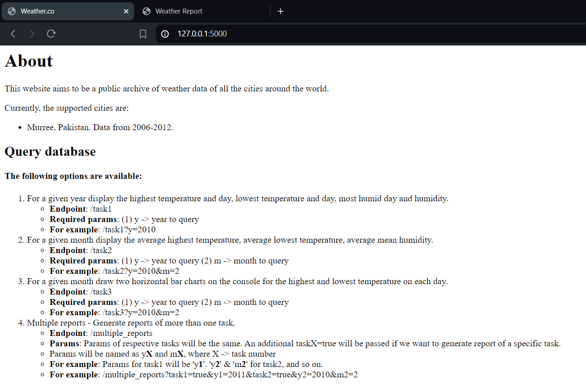
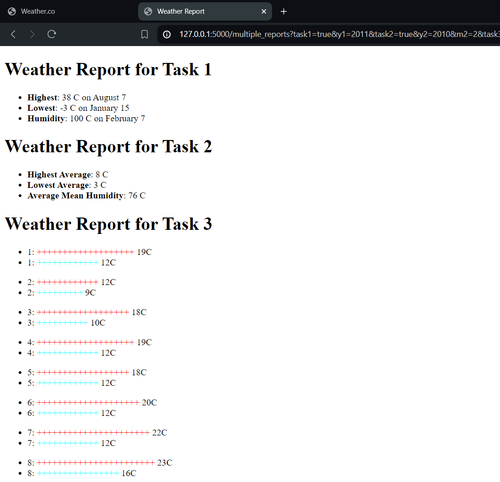

# Weather Man Flask
An upgrade of [Weather Man CLI](https://github.com/saadberry/weather-man-cli), this project serves data via Flask endpoints.

## Setup
1. Clone this directory
2. Create a virtual environment.
    - On Linux, you can do this by running the following commands:
        - `virtualenv venv`
        - `source venve/bin/activate`
3. Install the packages in `requirements.txt`:
    - `pip install -r requirements.txt` (Use 'pip3' instead of 'pip' if you are on Python3)
4. Start the server:
    - `flask --app server run` 

## Screenshots
### Home page

### Generated report
